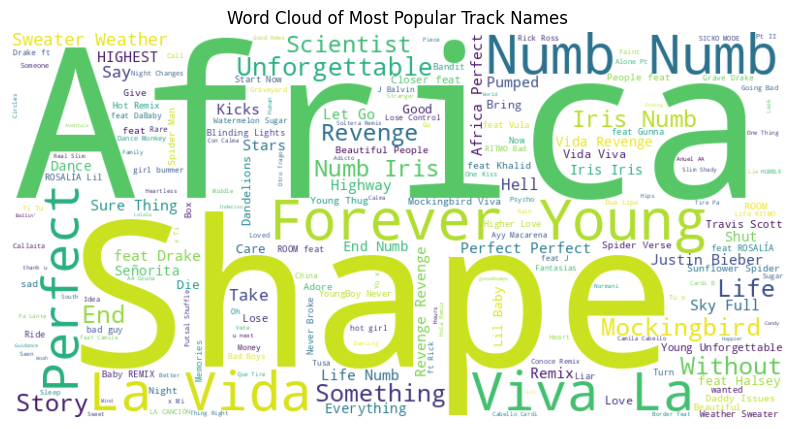
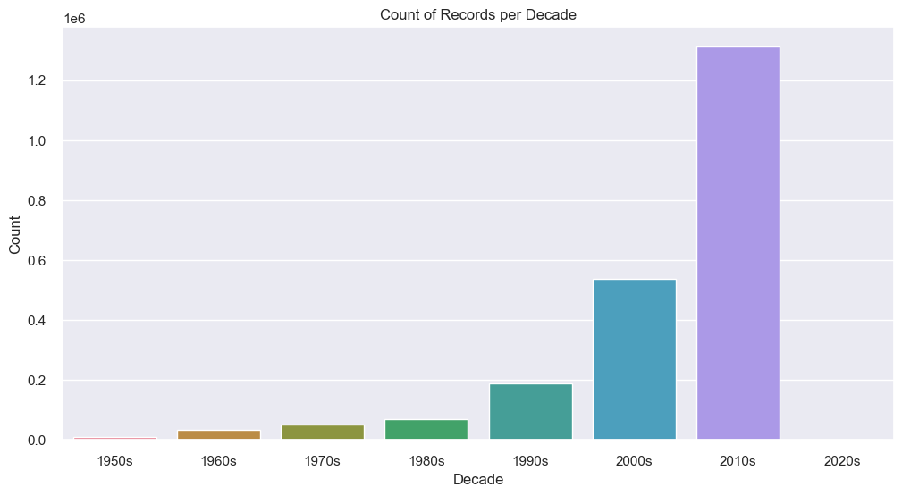
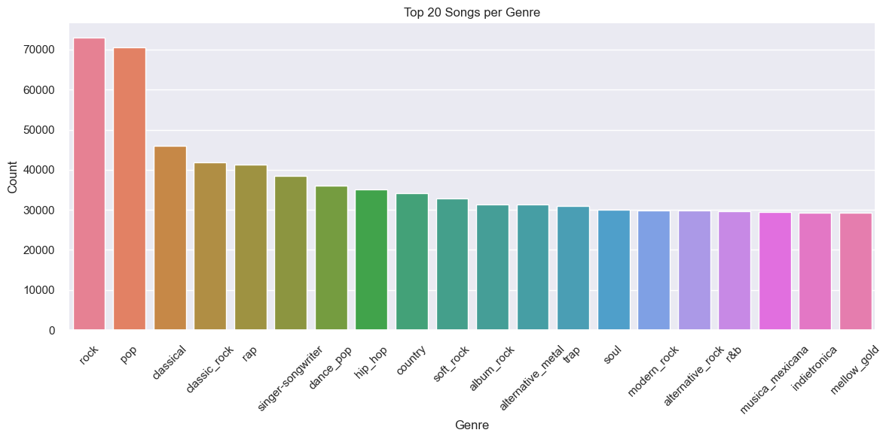

# AI_Spotify_Recommendation_Systems  

### Data Dictionary  

#### `final.csv`
[Link to dataset](https://drive.google.com/drive/folders/1PXvvR0lWxabjyfskaVesVxVuUeeF8Y8U?usp=drive_link)

About our variables in dataset:

| Variable               | Class     | Description |
|:-----------------------|:----------|:------------|
| artist_name            | character | Name of the artist. |
| track_uri              | character | Unique identifier (URI) for the track on Spotify. |
| artist_uri             | character | Unique identifier (URI) for the artist on Spotify. |
| track_name             | character | Name of the track. |
| album_uri              | character | Unique identifier (URI) for the album on Spotify. |
| duration_ms            | double    | Duration of the track in milliseconds. |
| album_name             | character | Name of the album the track belongs to. |
| album_id               | character | Unique ID of the album. |
| danceability           | double    | Danceability score (0.0 - 1.0) indicating how suitable the track is for dancing. |
| energy                 | double    | Measure of intensity and activity (0.0 - 1.0). Higher values indicate more energetic tracks. |
| key                    | double    | Overall key of the track. Values map to standard Pitch Class notation. |
| loudness               | double    | Average loudness of the track in decibels (dB). Typical range is -60 to 0 dB. |
| mode                   | double    | Modality of the track (1 = Major, 0 = Minor). |
| speechiness            | double    | Score (0.0 - 1.0) detecting the presence of spoken words in the track. |
| acousticness           | double    | Confidence score (0.0 - 1.0) representing whether the track is acoustic. |
| instrumentalness       | double    | Score predicting if the track contains no vocals. Values > 0.5 indicate instrumental tracks. |
| liveness               | double    | Probability of the track being performed live. Values > 0.8 strongly indicate a live recording. |
| valence                | double    | Musical positiveness score (0.0 - 1.0). Higher values indicate more positive moods (e.g., cheerful, euphoric). |
| tempo                  | double    | Estimated tempo of the track in beats per minute (BPM). |
| time_signature         | double    | Time signature of the track (e.g., 4 for 4/4 time). |
| release_date           | character | Year when the album or track was released. |
| popularity             | double    | Popularity score of the track on Spotify (0 - 100). Higher values indicate more popular tracks. |
| artist_pop             | double    | Popularity score of the artist on Spotify (0 - 100). |
| genres                 | character | List of genres associated with the artist (space-separated). |

### EDA

**Word cloud from the most popular songs**

**How the overall sound of music has changed from 1950 to 2020s...**

**Bar plot to visualize the duration of songs over the years**

**Number of songs of different genres**

